# ***Manual de emisión de desperdicio***

#### En el siguiente manual se explica como se realizan las diferentes emisiones de todos los desperdicios en el área de Sellado, evidenciando visualmente cada paso a seguir

#### El desperdicio se pesa en dos momentos, ya sea a finalizar el turno o cuando se termina un trabajo, el operario se dirige a la báscula con cada una de las bolsas marcadas con su respectivo código o motivo, al momento de pesar lleva una planilla manual donde registra:
- Fecha, nombre, ID empleado, trabajo, parte, turno, máquina, peso del paquete, # de bolsas por paquete, # de planilla de calidad
- Códigos de desperdicio con su respectiva descripción
#### A medida que pesa cada desperdicio anota cada uno de los pesos que muestra la báscula de acuerdo al código o motivo de cada bolsa, esa validación la realiza junto a un patinador o un coordinador de turno
#### Después de anotar en la planilla se dirige a la máquina e ingresa todos estos reportes al epicor.

###  Paso a paso:
1. Ingreso a epicor con usuario, contraseña y turno correspondientes 
   >Ingresamos el ID empleado 
   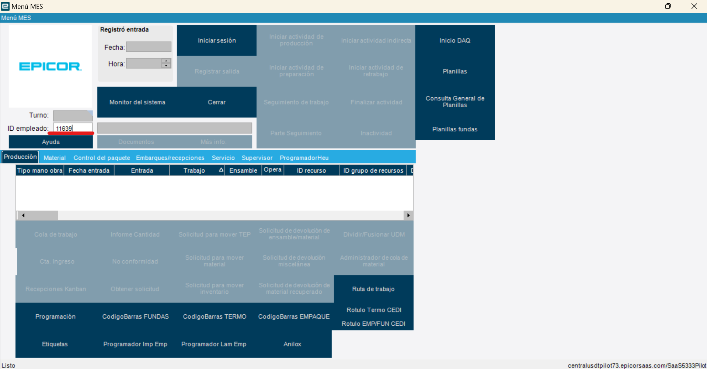
   >Indicamos el turno en el que se va a trabajar
   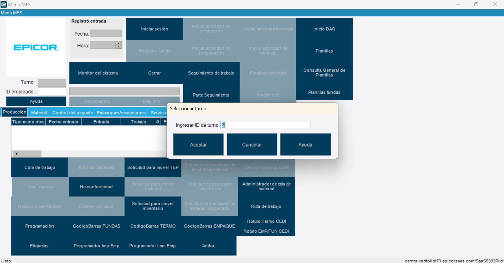
2. Iniciar actividad de producción 
   >Ingresamos al ítem Iniciar actividad de producción 
   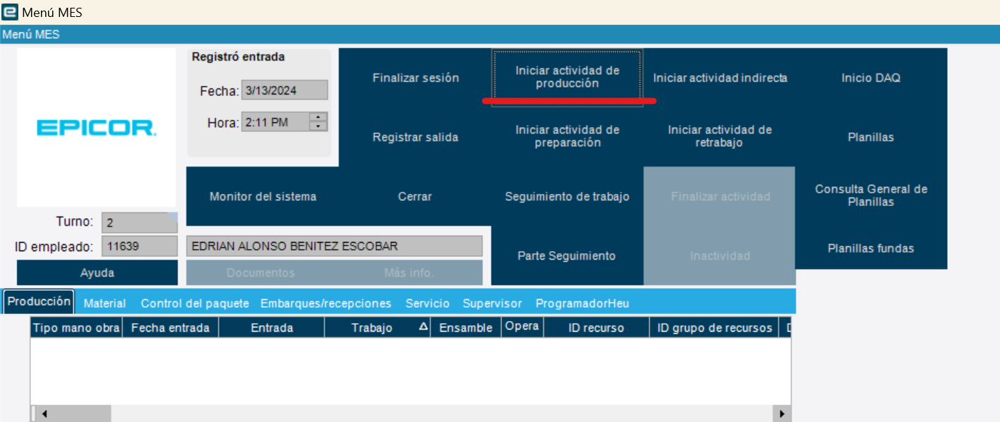
   >Ingresamos el trabajo, en ensamble verificamos que coincida la parte con la orden y en operación seleccionamos el proceso de *sellado* 
   >>Recuerda que debes verificar la máquina en la cual se va a realizar el trabajo
   >Click en Aceptar
   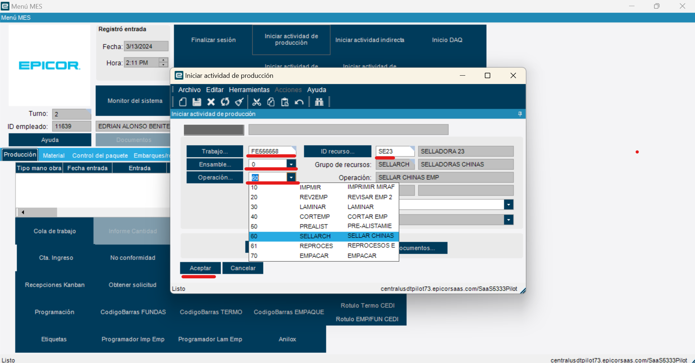

***Cuando se termina un trabajo o se va a entregar turno, se procede a la emisión*** 
3. Finalizar trabajo o finalizar turno para reportar desperdicios
   >Finalizamos actividad para el reporte de desperdicios
   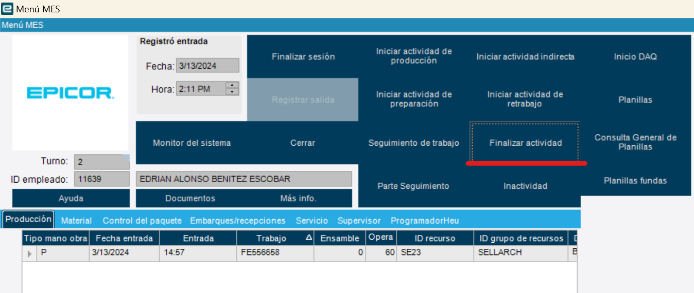
   >Ingresamos a Reportar Scrap
   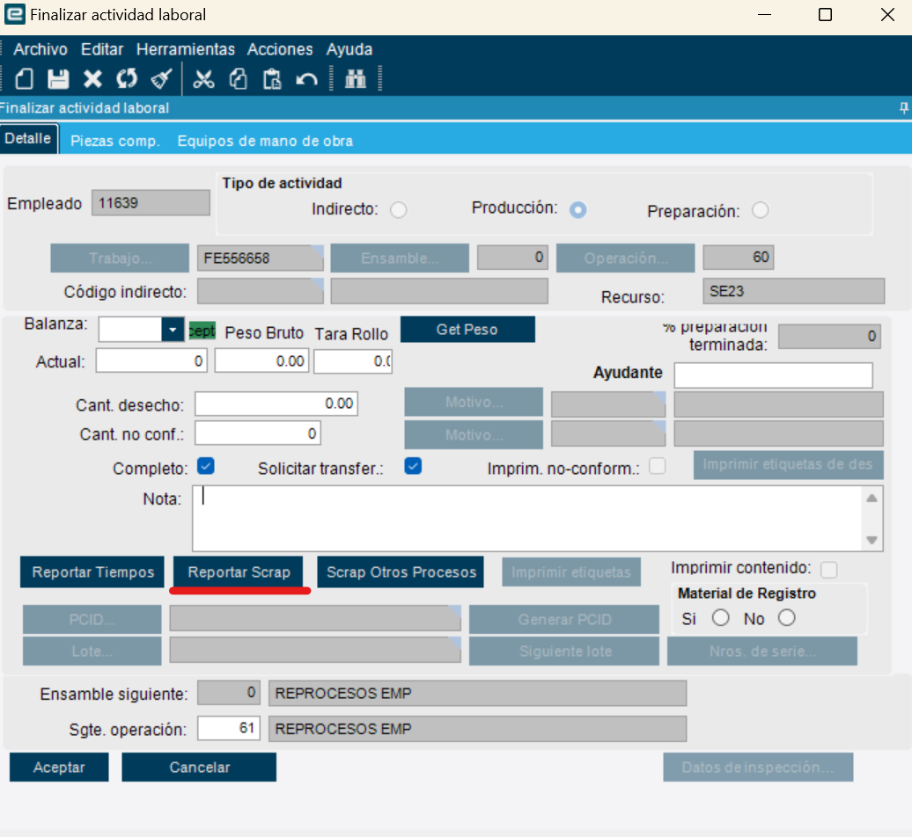
   >Nuevo desperdicio
   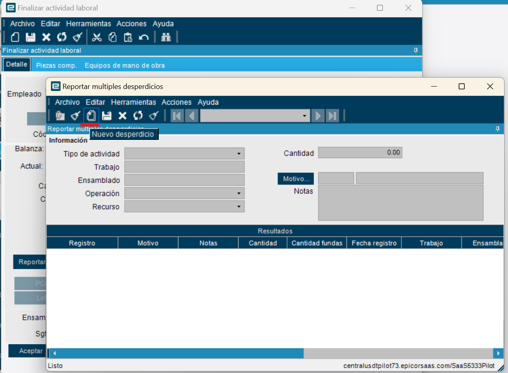
   >Verificamos que este en produción y el # del trabajo 
   >>En cantidad se introduce el peso, en motivo, el código del desperdicio y con la tecla *Tab* muestra la descripción de ese desperdicio
   >>>En la parte inferior se observa lo que se esta ingresando, luego de verificar los registros, **damos click en guardar**, para seguir con el siguiente desperdicio
   
   >Para generar el siguiente reporte damos click en Nuevo desperdicio 
   
   >Realizamos el mismo proceso con los demás desperdicios generados, validando código, proceso, descripción y peso
   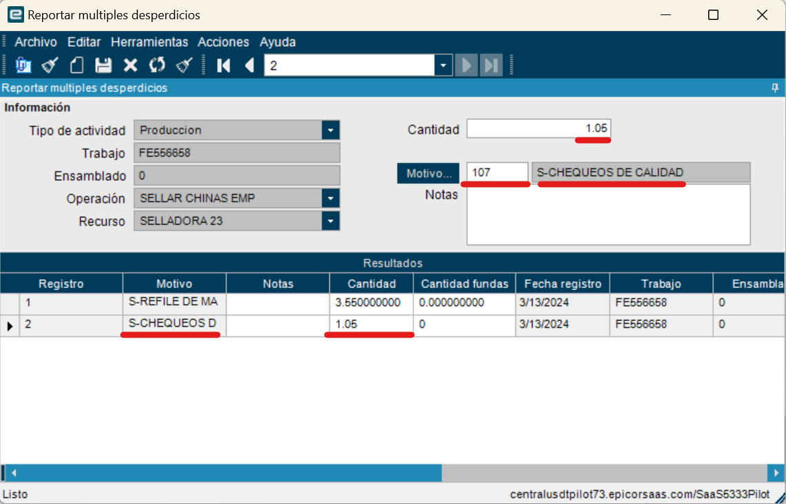
   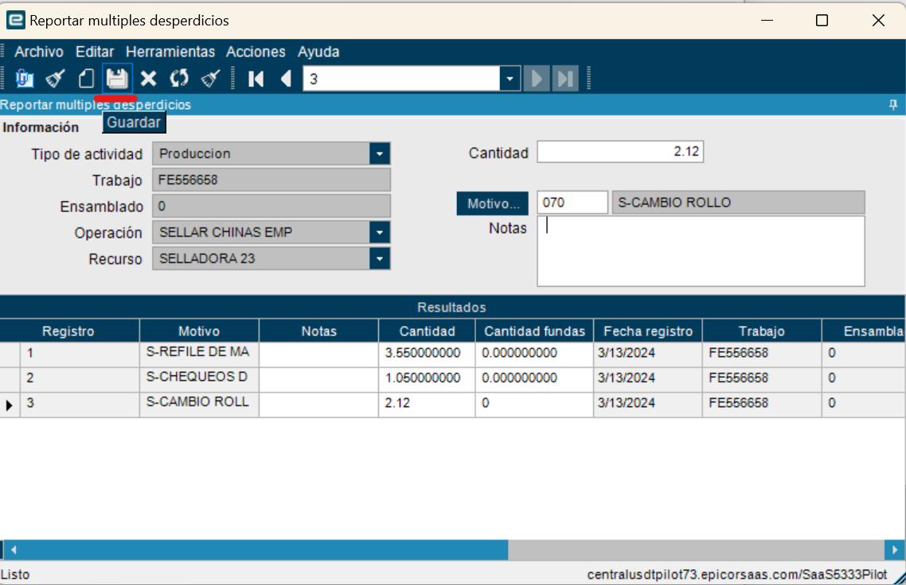
   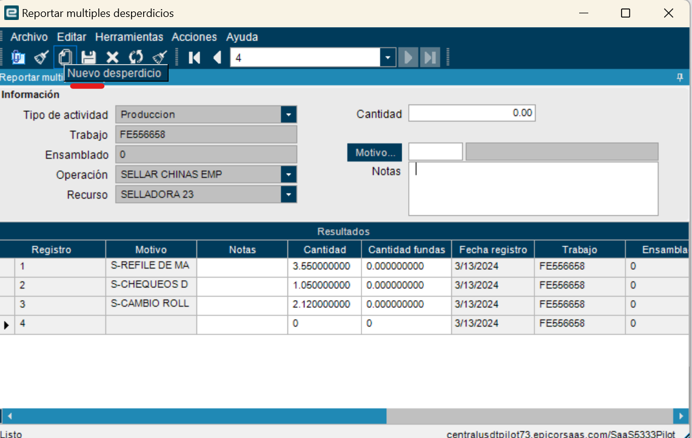
   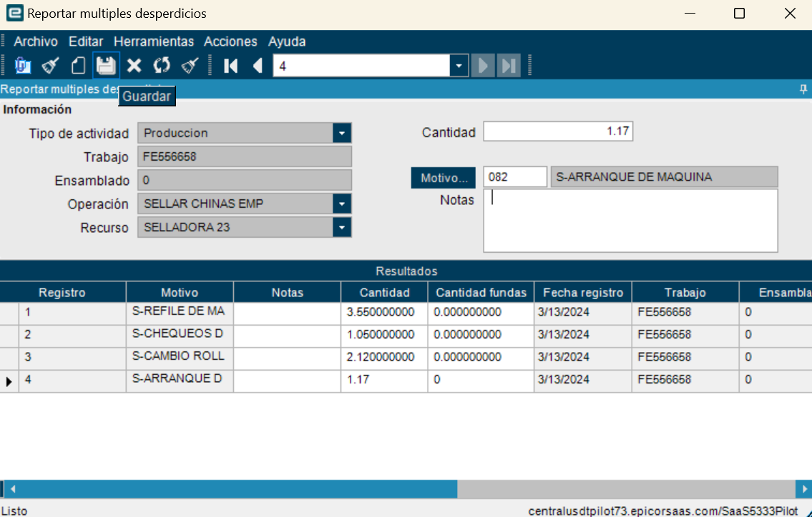
   >Realizamos el mismo proceso con cada uno de los códigos, motivos y desperdicios generados en ese trabajo
   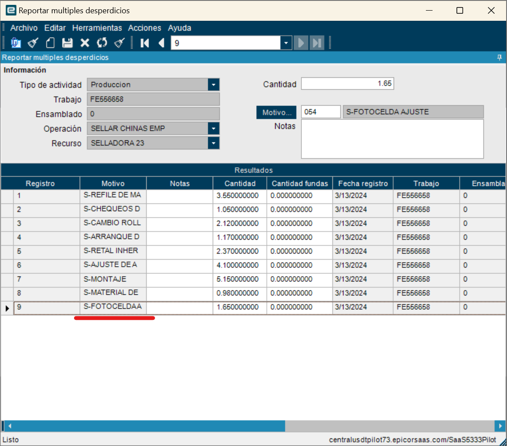
   ## Importante
   ### Luego de ingresar cada registro, se debe dar click en guardar
   >En este espacio muestra la cantidad de registros emitidos
   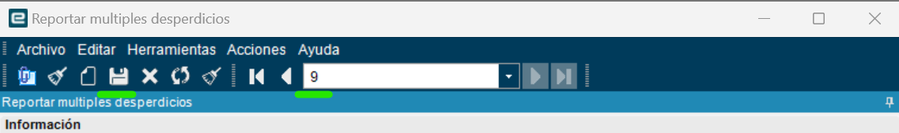

   
4. Finalizar actividad 
   >Ingresamos peso total de la producción, unidades producidas, seleccionamos *completo* y damos click en Aceptar
   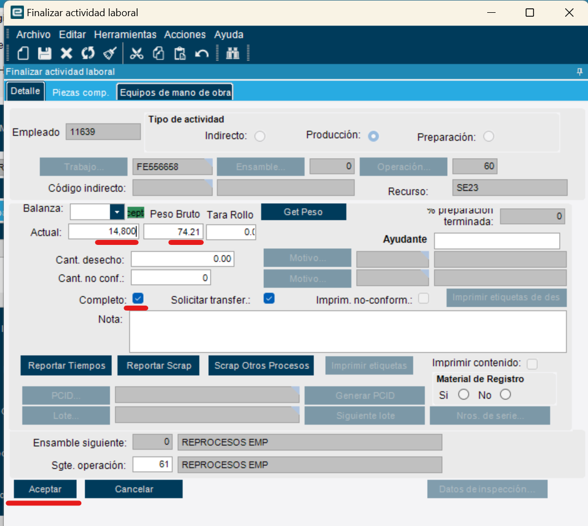

  